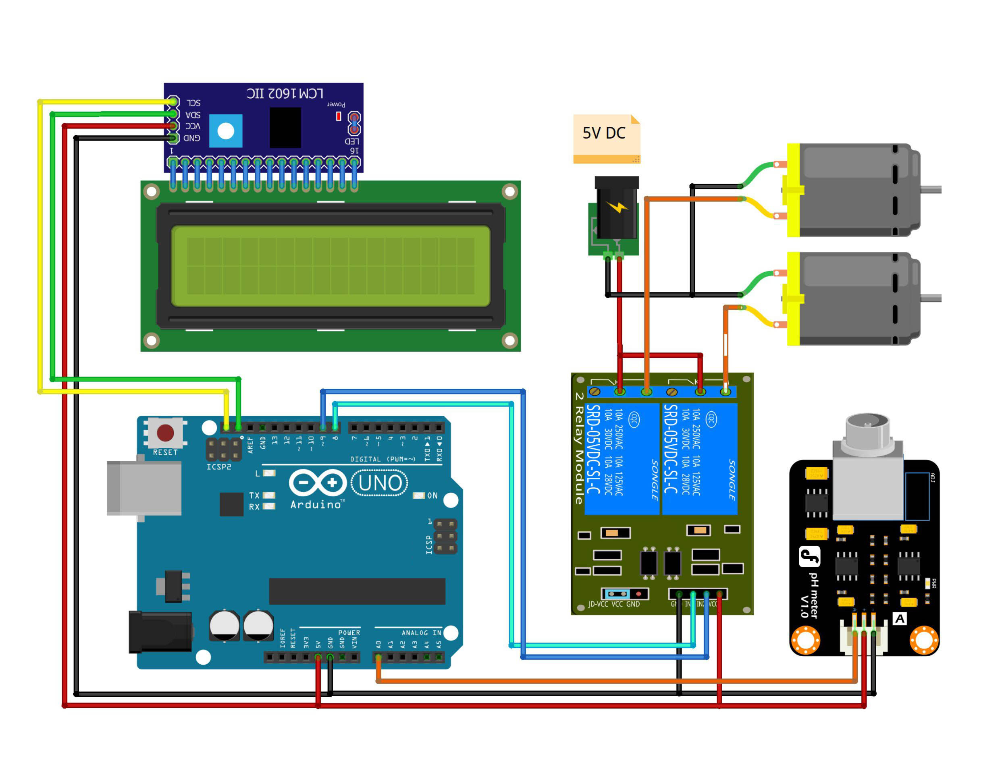

# Hydroponic Plant Water pH Stabilizer Tool

This project provides a pH stabilizer for hydroponic plant water using an Arduino. The system monitors the pH level and automatically adjusts it using pH up and pH down solutions to maintain optimal conditions for plant growth. The pH value is displayed on an LCD screen.

## Components Used

- **Arduino IDE**
- **Library: LiquidCrystal_I2C**
- **Arduino Uno** (or compatible board) - 1 Unit
- **pH Module Sensor** - 1 Unit (Type pH Sensor dfRobot)
- **pH Up Pump - (Motor DC)** - 1 Unit
- **pH Down Pump - (Motor DC)** - 1 Unit
- **LiquidCrystal_I2C LCD (16x2) + with I2C set** - 1 Unit
- **Project Board / BreadBoard** - 1 Unit
- **Jumper Wires**
- **Power Supply** (for Arduino and pumps)

## Schematic

Below you can see a schematic image to facilitate the wiring of cables from the microcontroller to devices, both input and output sensors:



## Circuit Diagram

### Wiring Instructions

- **pH Sensor:**
  - **Signal Pin** to Analog Pin A0 on the Arduino
  - **VCC** to 5V
  - **GND** to GND
- **pH Up Pump:**
  - **Control Pin** to Digital Pin 8 (D8) on the Arduino
  - **Power Pin** to an external power source
- **pH Down Pump:**
  - **Control Pin** to Digital Pin 9 (D9) on the Arduino
  - **Power Pin** to an external power source
- **LCD (16x2) I2C:**
  - **SDA I2C** to pin A4 on the Arduino
  - **SCL I2C** to pin A5 on the Arduino
  - **VCC I2C** to 5V
  - **GND I2C** to GND
- \*\*Pin I2C – Pin LCD
- **(+) Adapter – Com Relay Ch1 dan Ch2**
- **(-) Adapter – (-) Motor DC 1 dan 2**
- **NO Relay Ch1 – (+) Motor DC1**
- **NO Relay Ch2 – (+) Motor DC2**

## How It Works

- The pH sensor measures the pH level of the hydroponic plant water.
- The sensor value is converted to pH using calibration values.
- The pH value is displayed on the LCD screen.
- Based on the pH reading, the system controls the pH up and pH down pumps:
  - **pH Up Pump** is activated if the pH falls below 6.
  - **pH Down Pump** is activated if the pH rises above 8.
  - Both pumps are turned off if the pH is within the optimal range.

## Code Explanation

- **Sensor Initialization:** The pH sensor is connected to analog pin A0.
- **pH Calculation:** The pH level is calculated from the voltage read by the sensor.
- **Pump Control:** The pH up and pH down pumps are controlled based on the pH value:
  - Pumps are activated or deactivated to adjust the pH level.

```cpp
#include <LiquidCrystal_I2C.h>      // Library for LCD I2C
LiquidCrystal_I2C lcd(0x27, 16, 2); // I2C Address

#define SensorpH A0                 // pH Sensor on pin A0
#define pHup 8
#define pHdown 9

float teganganPh7 = 2.73;   // Calibration value for pH 7
float teganganPh4 = 3.3;    // Calibration value for pH 4
float Po;

void setup() {
  lcd.init();                 // Initialize LCD
  lcd.backlight();            // Turn on backlight
  pinMode(pHup, OUTPUT);      // Set I/O
  pinMode(pHdown, OUTPUT);
  digitalWrite(pHup, HIGH);   // Initial relay state
  digitalWrite(pHdown, HIGH);
}

void loop() {
  int sensorValue = analogRead(SensorpH);         // Read sensor value
  float voltage = sensorValue * (5.0 / 1023.0);   // Convert to voltage
  // Calculate pH
  Po = 7.00 + ((teganganPh7 - voltage) / ((teganganPh4 - teganganPh7)/3));
  lcd.setCursor(0, 0);
  lcd.print("pH Value = ");
  lcd.print(Po);                              // Display pH value

  if(Po < 6){                                 // If pH < 6
    digitalWrite(pHup, LOW);                  // Turn on pH up pump
    digitalWrite(pHdown, HIGH);
  }
  else if(Po > 8){                            // If pH > 8
    digitalWrite(pHup, HIGH);
    digitalWrite(pHdown, LOW);                // Turn on pH down pump
  }
  else{
    digitalWrite(pHup, HIGH);
    digitalWrite(pHdown, HIGH);               // Turn off both pumps
  }

  delay(500);                                // Delay for 500 ms
  lcd.clear();                               // Clear LCD display
}
```

## Installation

1. Gather all components listed above.
2. Connect the components following the wiring instructions.
3. Open the Arduino IDE and connect your Arduino board.
4. Copy the provided code into the Arduino IDE.
5. Upload the code to your Arduino Uno.

## Usage

- The system continuously monitors the pH level of the hydroponic plant water and adjusts it as needed.
- The pH value is updated and displayed on the LCD screen every half second.

## Conclusion

- The Hydroponic Plant Water pH Stabilizer Tool effectively maintains optimal pH levels for hydroponic systems. It automates pH adjustments, ensuring healthy plant growth and a stable growing environment.

- Stable pH will be set to a value of 7, when the pH of the water less than 6 pump 1 will turn on and deliver pH Up to increase the pH value to a stable value, that is Also type pH more than 8 then pump 2 will turn on and channels pH Down to lower the pH value to stable numbers.

#### @Copyright 2024 | Hydroponic-Plant-Water-pH-Stabilizer-Tool
